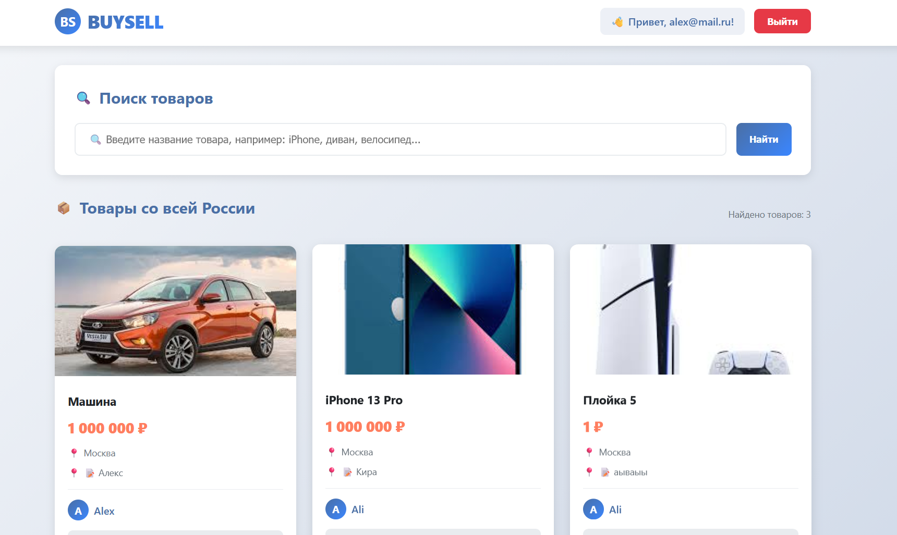
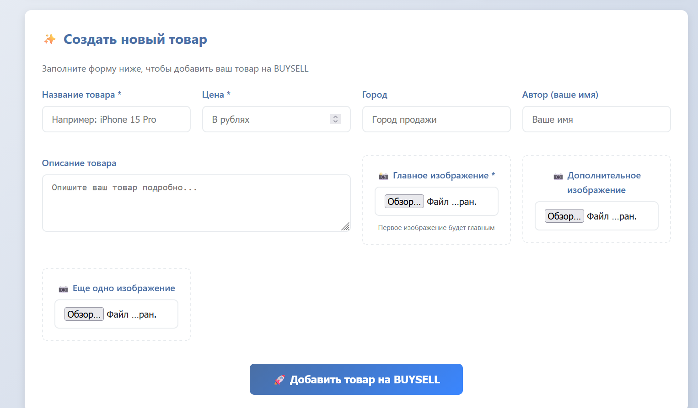
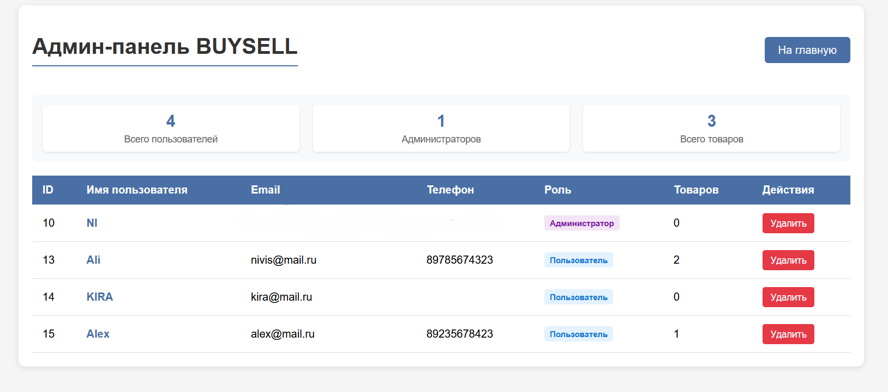
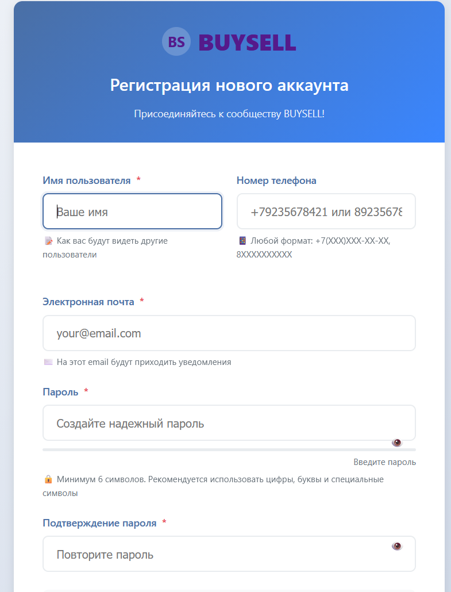

BUYSELL – Маркетплейс на Java-стеке

BUYSELL – это полноценное веб-приложение, имитирующее реальный маркетплейс с полным циклом работы.
Проект построен по MVC-архитектуре с четким разделением слоев, обеспечивая регистрацию пользователей,
публикацию товаров с изображениями, поиск по каталогу, управление контентом и безопасное взаимодействие между пользователями.
Основные возможности

     Безопасная аутентификация и авторизация через Spring Security

     CSRF-защита и валидация данных

     Асинхронная регистрация: запросы отправляются в Kafka, развязывая сервис авторизации от основной логики.

    Верификация email: разрешены только адреса домена @g.nsu.ru, шестизначный код кешируется в Caffeine на 5 минут.

    Активация пользователя: после регистрации пользователь создаётся в неактивном состоянии и активируется только после успешного ввода кода.

    Безопасность: сессионная аутентификация Spring Security, CSRF-защита, CORS для фронтенда на localhost:3000, роли ROLE_USER и ROLE_ADMIN с контролем доступа через @PreAuthorize.

    Управление товарами и изображениями: полный CRUD товаров с загрузкой до трёх изображений (хранятся в PostgreSQL как bytea).

    Глобальная обработка ошибок: единый ExceptionHandler с понятными HTTP-статусами и сообщениями.

Архитектура

    Слои: Controller → Service → Repository.

    Поток регистрации: AuthController → Kafka producer → RegistrationKafkaConsumer → EmailVerificationService.

    Код подтверждения хранится в Caffeine, удаляется после проверки.

    Изображения товаров сохраняются в БД.

Технологический стек
Backend

    Java 17, Spring Boot 3, Spring MVC

    Spring Security (сессии), BCrypt, CSRF

    Spring Data JPA (Hibernate), PostgreSQL, MapStruct

    Apache Kafka (producer/consumer), Jackson

    Caffeine Cache (для кодов верификации)

    JavaMailSender (SMTP)

    Gradle

Frontend (Server-Side Rendering)

    Шаблонизатор: Thymeleaf

    Стили: Чистый CSS3 (CSS Grid, Flexbox, CSS Variables, анимации)

    Интерактивность: Нативный JavaScript (ES6+)

    Дизайн: Кастомная, адаптивная верстка (mobile-friendly)

Основные эндпоинты

    POST /api/auth/register – отправить запрос на регистрацию в Kafka (публичный)

    POST /api/auth/login – вход по email/паролю, создание сессии (публичный)

    POST /api/verify – подтвердить email кодом (публичный)

    GET /api/products – список товаров (поиск по названию) (публичный)

    POST /api/products – создать товар с изображениями (только аутентифицированные)

    DELETE /api/products/{id} – удалить свой товар (владелец/админ)

    GET /api/users/{id} – профиль пользователя (аутентифицированные)

    PUT /api/users/{id} – обновить пользователя (владелец/админ)

    DELETE /api/users/{id} – удалить пользователя (только админ)

